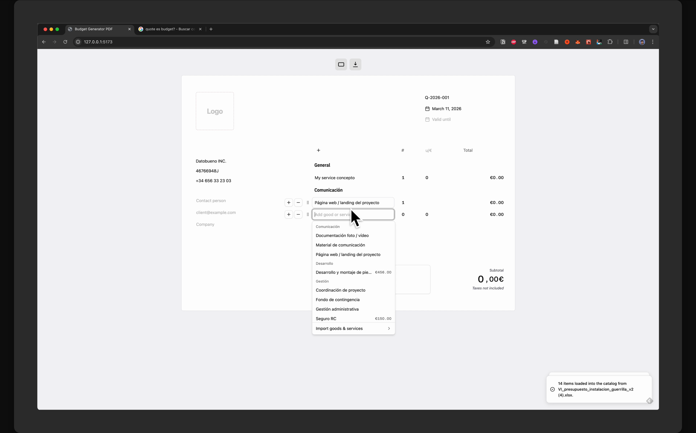

# budget-generator-interface

`budget-generator-interface` is a React + TypeScript app for creating quotes and budgets, previewing printable sheets, and exporting client-facing PDFs.

## Demo

<a href="./assets/demo.mp4">
  
</a>

Watch the product walkthrough: [`assets/demo.mp4`](./assets/demo.mp4)

The repository includes a short product walkthrough so contributors and evaluators can quickly see how the editor, preview, and PDF export flow work in practice.

It is maintained by `datobueno`, which is the association behind the project. `datobueno` is not the product name.

## Highlights
- Live quote editing with line items, taxes, and printable sheet preview
- Client-facing PDF export with `@react-pdf/renderer`
- Optional Google Contacts import
- Optional Google Sheets import
- Optional exchange-rate lookup via Frankfurter

## Stack
- React 18
- Vite
- TypeScript
- Tailwind CSS
- shadcn/ui
- `@react-pdf/renderer`
- Sonner

## Quick Start
```bash
corepack enable
corepack prepare pnpm@latest --activate
pnpm install --frozen-lockfile
cp .env.example .env.local
pnpm run dev
```

Open `http://127.0.0.1:5173`.

## Environment
Base configuration lives in [`.env.example`](.env.example). Copy it to `.env.local` for local development.

Google integrations are optional and each contributor should use their own Google Cloud project and browser-safe credentials. See [Google setup](docs/google-setup.md) before enabling them.

Important: this is a Vite client application. Any `VITE_*` value is exposed to the browser bundle. Do not put server secrets, OAuth client secrets, refresh tokens, or service-account credentials in `.env.local`.

## Available Commands
```bash
pnpm run dev
pnpm run preview
pnpm run typecheck
pnpm run test
pnpm run build
pnpm run doctor
pnpm run doctor:network
pnpm run repair:deps
```

## Project Structure
```text
src/
  app/
  pages/
  shared/
  entities/
  features/
  components/ui/
```

Architecture details live in [docs/architecture.md](docs/architecture.md).

## Contributing
Contributions are welcome. Before opening a pull request:

1. Read [CONTRIBUTING.md](CONTRIBUTING.md).
2. Keep changes scoped to the right architectural layer.
3. Run `pnpm run doctor`, `pnpm run test`, and `pnpm run build`.
4. Include screenshots or recordings for visible UI changes.

Good first areas to contribute:
- `src/entities/*` for pure domain logic
- `src/features/*` for user workflows and integrations
- `src/shared/*` for reusable utilities and UI wrappers
- `src/pages/*` for page composition and wiring

## Security
Please do not report vulnerabilities in public issues. Follow [SECURITY.md](SECURITY.md).

## Support
If this project is useful to you and you want to help fund maintenance, see [GitHub Sponsors](https://github.com/sponsors/datobueno).

## License
This project is released under the GNU AGPL `3.0-or-later`. See [LICENSE](LICENSE).

If you run a modified networked version of this software, you are responsible for making the corresponding source available to its users under the AGPL.

## Trademarks
The product and repository name are `budget-generator-interface`.

`datobueno` is the maintaining association, not the product name. See [TRADEMARKS.md](TRADEMARKS.md) for branding and attribution rules.
